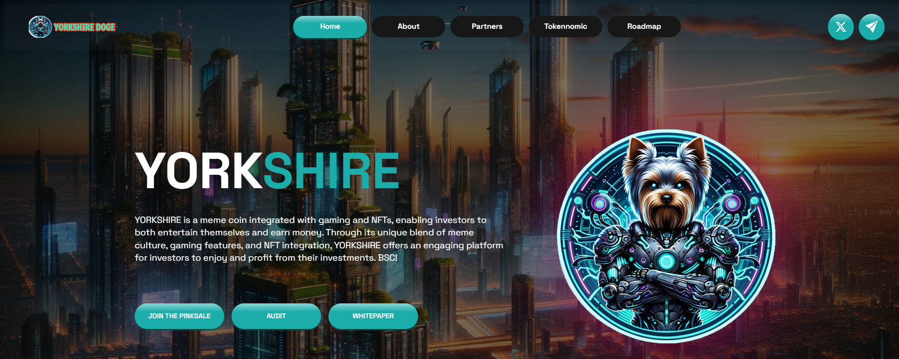

# Resources

<figure><figcaption></figcaption></figure>

🔗 **Leveraging **_**BSC**_** Blockchain for Unmatched Reliability**

_<mark style="color:red;">YORKSHIRE DOGE</mark> strategically positions itself on the BSC blockchain, harnessing the robust infrastructure and global acceptance of the BNB standard. By choosing BSC as its primary platform, <mark style="color:red;">YORKSHIRE DOGE</mark> ensures not only reliability but also seamless integration into the broader Solana ecosystem. This strategic choice enhances accessibility, fostering a community that can easily interact with the token on BSC-compatible platforms._

🧠 **Smart Contracts: Powering Efficiency in Token Operations**

_At the heart of <mark style="color:red;">YORKSHIRE DOGE</mark> operational prowess lies the utilization of smart contracts. These autonomous and self-executing contracts serve as the backbone of the project, facilitating the seamless execution of token swaps and native coin conversions. The implementation of smart contracts not only ensures the integrity of transactions but also establishes a trustless and efficient mechanism for users to engage with the various features offered by <mark style="color:red;">YORKSHIRE DOGE</mark>._

💡 **Total Supply of **<mark style="color:purple;">**1 BILLION**</mark>** Tokens: A Commitment to Scarcity**

_Scarcity often underlines the intrinsic value of a cryptocurrency, and <mark style="color:red;">YORKSHIRE DOGE</mark> consciously embraces this principle. With a capped total supply of_ <mark style="color:purple;">**1 BILLION**</mark> _tokens, the project ensures a controlled and finite availability, contributing significantly to its value proposition. This scarcity fosters a sense of exclusivity, appealing to investors seeking assets with limited circulation, and establishing a foundation for potential appreciation in value over time._

📊 **Contributing to the Value Proposition: Scarcity as a Key Element**

_Scarcity is not just a design choice for <mark style="color:red;">YORKSHIRE DOGE</mark>; it's a fundamental aspect of the project's value proposition. By limiting the token supply, <mark style="color:red;">YORKSHIRE DOGE</mark> creates a scenario where demand could potentially outstrip availability, establishing a foundational element for potential long-term value growth. This scarcity, coupled with the utility-driven features, paints a compelling picture for investors and enthusiasts looking to align themselves with a project that combines innovation with a strategic approach to tokenomics._

🚀 **A Visionary Approach to Crypto Engagement**

_As <mark style="color:red;">YORKSHIRE DOGE</mark> navigates the crypto landscape, it does so with precision, leveraging BSC\`s capabilities, smart contract efficiencies, and the strategic implementation of scarcity. This visionary approach not only establishes a reliable foundation for current operations but also positions <mark style="color:red;">YORKSHIRE DOGE</mark> as a project with longevity._
