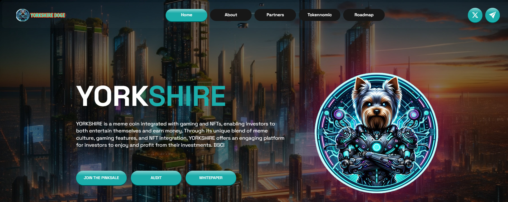

# Security

<figure><figcaption></figcaption></figure>

**FRESHCOIN **<mark style="color:orange;">**YorkShire Doge**</mark>**: A Trustworthy Venture Verified through Rigorous Audit**

🌟 **FRESHCOIN** _, a leading blockchain auditing firm, recently conducted a comprehensive audit on YORKSHIRE DOGE, reaffirming its commitment to transparency, security, and reliability._

_The audit delved into various aspects of YORKSHIRE smart contracts, focusing on code integrity, security vulnerabilities, and adherence to industry best practices._ **FRESHCOIN**  _team of experienced auditors rigorously assessed the tokenomics, ensuring the integrity of the total supply of 1 BILLION  tokens and verifying the mechanisms for liquidity provision and token swaps._

🌟 _The audit process also scrutinized the bridge functionality connecting the Bitcoin and BSC blockchains, confirming the 1:1 token exchange ratio and the efficiency of the native coin conversion smart contract._ **FRESHCOIN**  _thorough examination further bolstered the confidence in YORKSHIRE ability to seamlessly facilitate cross-chain operations._

_The results of the audit underscore_ **FRESHCOIN**  _stamp of approval on the project's technical robustness and security measures. Investors, enthusiasts, and stakeholders can rest assured that YORKSHIRE has undergone a meticulous evaluation, aligning with the highest standards of the blockchain industry._

🌟 **FRESHCOIN** _ult's audit report on YORKSHIRE stands as a testament to the project's commitment to accountability and the establishment of a secure and reliable platform for its community. As YORKSHIRE continues to shape the future of cross-chain interoperability and meme culture, this audit serves as a foundation for building trust within the crypto community._
